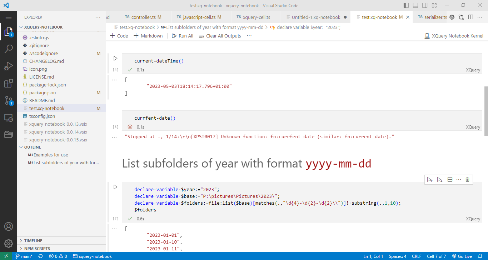

# XQuery notebook

An experimental XQuery [notebook for VSCode](https://code.visualstudio.com/blogs/2021/11/08/custom-notebooks).

## Requirements

Requires access to a running BaseX server. The connection uses the Client API.
Settings    
## Usage
### create a notebook
### add XQuery cells
Adding a code cell defaults to type `xquery`. `Javascript` cells are also supported.
### prolog cells
Before executing a XQuery cell, preceding XQuery cells are examined for content starting with '(:<:)' The first such cell, if any, found searching towards the first cell is prefixed to the current cell before execution.

## Notes

The Jupyter notebook schema
https://github.com/jupyter/nbformat/blob/f101cd2b062609823e9cdbf0e8de697a6c22638e/nbformat/v4/nbformat.v4.5.schema.json